# Overview

This sample solution demonstrates the implementation of Azure Functions (.NET 9, [isolated worker model](https://learn.microsoft.com/en-us/azure/azure-functions/dotnet-isolated-process-guide?tabs=hostbuilder%2Cwindows)) with Blob Storage and Service Bus integrations. The project consists of two main functions:

1. **External Function**: Simulates order taking service and handles incoming HTTP requests and processes orders through the Service Bus queue.
   - Exposes HTTP endpoints for order processing
   - Integrates with Azure Blob Storage for input document storage and Azure Service Bus for message queuing
   - Available at port 8081 by default

2. **Internal Function**: Simulates warehouse service and processes messages from Service Bus and stores output data in Azure Blob Storage.
   - Listens to Service Bus messages
   - Handles blob storage operations by updating the input document with the warehouse data and storing it in the output container
   - Available at port 8082 by default

## Architecture

- 2 Azure Functions (.NET 8.0 Isolated Process)
- Azure Service Bus (using local emulator)
- Azure Storage (using BlobStorage emulator)
- Docker containers for local development

### Order processing flow diagram



## Project Structure

- `src/`
  - `ExternalFunction/`: HTTP-triggered functions
    - `OrderHandlerFunction.cs`: Function to handle incoming orders and check status
    - `TestFunctions.cs`: Function to test the HTTP endpoints (health check, send/recieve/peek Service Bus messages)
  - `InternalFunction/`: Service Bus-triggered functions
  - `Core/`: Shared code and models
  - `Services/`: Common services and utilities
- `tests/`
  - `IntegrationTests/`: End-to-end testing leveraging (TestContainers .NET)[https://dotnet.testcontainers.org/]
  - `UnitTests/`: Unit testing
- `http/`: HTTP client test files for testing from (Rider IDE)[https://www.jetbrains.com/help/rider/Http_client_in__product__code_editor.html]
  - `OrderFunctions-endpoints.http`: HTTP endpoints for the OrderHandlerFunction
  - `TestFunctions-endpoints.http`: HTTP endpoints for the TestFunction

# Running the code

## Prerequisites
- .NET 9.0 SDK
- Docker Desktop (for testing)

## Local Development with IDE

1. Start the required dependencies (Azurite and Service Bus emulator):
```bash
docker compose -f docker-compose-dependencies.yaml up -d
```

2. Run the External/Internal Functions from yur IDE of choice.
3. Test the functions using the provided HTTP files in the `http/` directory

To stop the dependencies:
```bash
docker compose -f docker-compose-dependencies.yaml down
```

## Local Development with Docker

1. Build the function images:
```bash
# Build External Function
docker build --build-arg FunctionDir=ExternalFunction -t az-func-with-sb-external .

# Build Internal Function
docker build --build-arg FunctionDir=InternalFunction -t az-func-with-sb-internal .
```

2. Run the containers and dependencies:
```bash
# Start dependencies
docker compose -f docker-compose.yaml up -d
```

3. Clean up:
```bash
docker compose -f docker-compose.yaml down
```

## Testing
Use the provided HTTP files in the `http/` directory to test the endpoints:
- `OrderFunctions-endpoints.http`: Test order processing endpoints
- `TestFunctions-endpoints.http`: Test utility endpoints