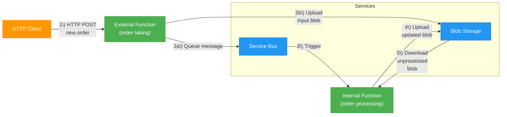

```mermaid
flowchart LR
    Client[HTTP Client]
    ExternalFn["External Function<br>(order taking)"]
    
    subgraph Services
        ServiceBus[Service Bus]
        BlobStorage[Blob Storage]
    end
    
    InternalFn["Internal Function<br>(order processing)"]
    
    Client -->|"1\) HTTP POST<br>new order"| ExternalFn
    ExternalFn -->|"2a\) Queue message"| ServiceBus
    ExternalFn -->|"2b\) Upload<br>input blob"| BlobStorage
    ServiceBus -->|"3\) Trigger"| InternalFn
    InternalFn -->|"4\) Upload<br>updated blob"| BlobStorage
    BlobStorage -->|"5\) Download<br>unprocessed<br>blob"| InternalFn

    classDef function fill:#4CAF50,stroke:#45a049,color:white
    classDef emulator fill:#2196F3,stroke:#1976D2,color:white
    classDef client fill:#FF9800,stroke:#F57C00,color:white
    
    class ExternalFn,InternalFn function
    class ServiceBus,BlobStorage emulator
    class Client client
```